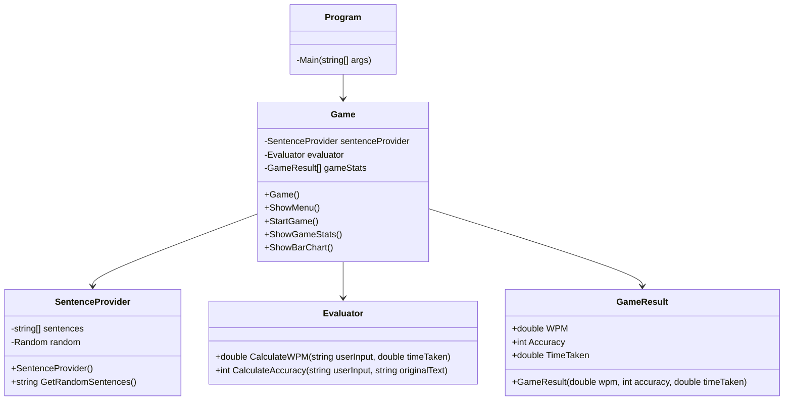

```mermaid
classDiagram
    class Program {
        -Main(string[] args)
    }

    class Game {
        -SentenceProvider sentenceProvider
        -Evaluator evaluator
        -GameResult[] gameStats
        +Game()
        +ShowMenu()
        +StartGame()
        +ShowGameStats()
        +ShowBarChart()
    }

    class SentenceProvider {
        -string[] sentences
        -Random random
        +SentenceProvider()
        +string GetRandomSentences()
    }

    class Evaluator {
        +double CalculateWPM(string userInput, double timeTaken)
        +int CalculateAccuracy(string userInput, string originalText)
    }

    class GameResult {
        +double WPM
        +int Accuracy
        +double TimeTaken
        +GameResult(double wpm, int accuracy, double timeTaken)
    }
    Program --> Game
    Game --> SentenceProvider
    Game --> Evaluator
    Game --> GameResult
```